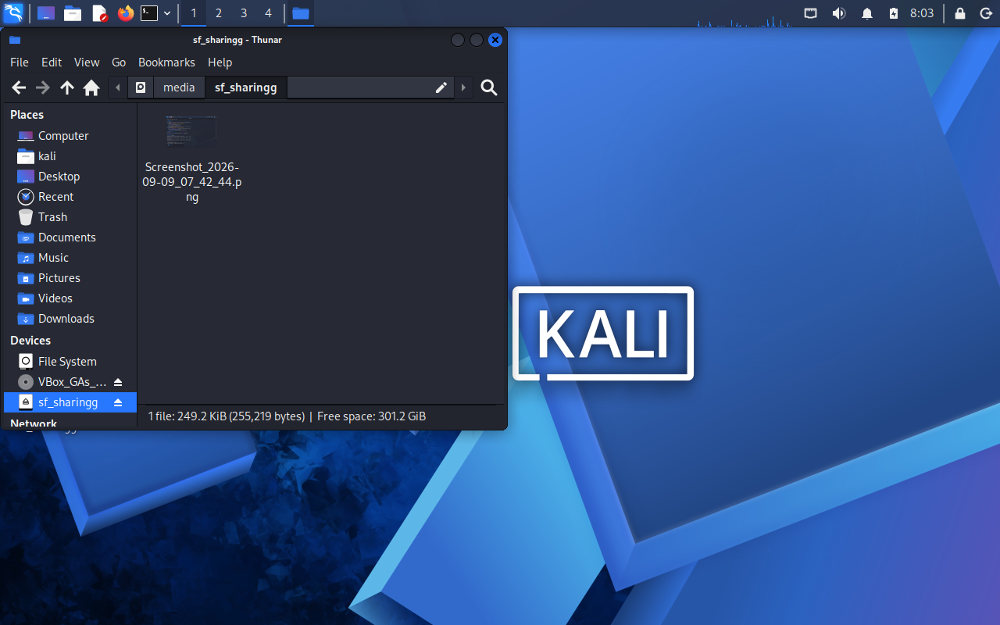
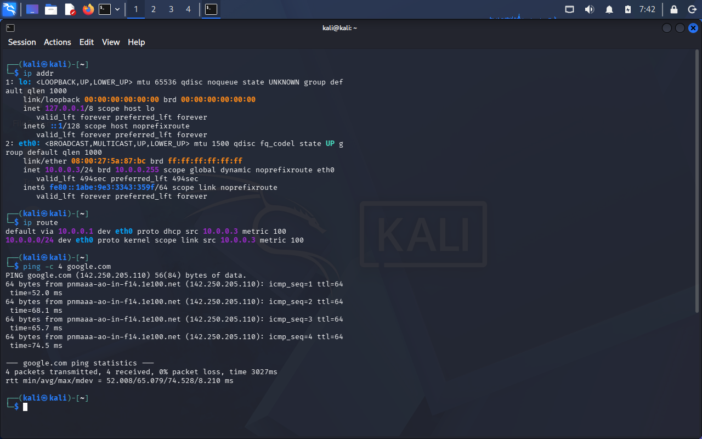

# Cybersecurity Lab Setup: VirtualBox & Kali Linux (WK1-PM1)

Welcome to my cybersecurity lab setup documentation! This repository covers the complete step-by-step setup of an isolated ethical hacking lab environment built on my personal laptop as part of the NetworkWalks Academy Week 1 Project Module.

---

## 💻 Host Machine Specifications

I built and tested this lab on my personal laptop. Here are the exact hardware and OS specifications:

| Component | Details |
|---|---|
| **Device Name** | Pashupatastra |
| **Model** | HP Victus Gaming Laptop |
| **Host OS** | Fedora Linux 44 (Workstation Edition) |
| **Processor** | 13th Gen Intel® Core™ i5-13420H |
| **Memory (RAM)** | 16 GB |
| **Storage** | 512 GB NVMe SSD |
| **GPU** | NVIDIA GeForce RTX 3050 (6 GB) |
| **Virtualization** | Intel VT-x (Enabled in BIOS) |

---

## 🎯 Lab Objectives

The main objective of this lab is to create a segmented, isolated testing subnet where I can practice penetration testing safely without exposing my local home network or host machine.

### Key Requirements (WK1-PM1):
* **Hypervisor:** Oracle VirtualBox.
* **Attack Machine:** Kali Linux (configured with static IP `10.0.0.2/24`).
* **Subnet:** Custom VirtualBox NATNetwork (`10.0.0.0/24`).
* **Gateway:** `10.0.0.1` with DNS set to `8.8.8.8`.
* **VM Features:** Bidirectional shared clipboard & drag-and-drop enabled.
* **Host Integration:** Shared folder mapping host `/Downloads` to the VM.
* **Safety:** Snapshot taken after clean configuration for instant rollback.

---

## 🛠️ Step-by-Step Lab Setup & Screenshots

### Step 1: Host Preparation & Extracting Kali Linux
On Fedora Linux, I first made sure virtualization was active and installed `p7zip` to handle compressed archives. Then I downloaded the official Kali Linux VirtualBox image and extracted the `.7z` file using terminal commands.


*Figure 1: Installing p7zip utilities on Fedora Linux via terminal.*


*Figure 2: Extracting the Kali Linux VirtualBox appliance using the terminal.*

---

### Step 2: Creating the NAT Network in VirtualBox
To ensure network isolation while allowing outbound internet access, I opened VirtualBox Global Tools → Network and created a custom **NAT Network** with prefix `10.0.0.0/24` and DHCP enabled.


*Figure 3: VirtualBox NAT Network creation with 10.0.0.0/24 subnet prefix.*

---

### Step 3: Attaching Kali VM to the NAT Network
Next, I imported the Kali Linux `.ova` into VirtualBox and configured its Network Adapter 1 to attach directly to `NATNetwork` with promiscuous mode set properly.


*Figure 4: Attaching Kali VM's network adapter to the custom NATNetwork.*

---

### Step 4: Allocating System Resources & VM Settings
To ensure Kali runs smoothly on my 16GB RAM laptop, I reviewed the VM settings, allocated 4GB of RAM, 2 vCPUs, and enabled hardware acceleration.


*Figure 5: Kali Linux VM resource settings and hardware allocation.*

---

### Step 5: Enabling Bidirectional Clipboard & Drag'n'Drop
Under **General → Advanced**, I enabled both **Shared Clipboard** and **Drag'n'Drop** in **Bidirectional** mode so I can easily move commands and snippets between my Fedora host and Kali Linux.


*Figure 6: Setting Shared Clipboard and Drag'n'Drop to Bidirectional.*

---

### Step 6: Setting Static IP & NetworkManager Configuration
Inside Kali Linux, I configured the wired connection with a static IP of `10.0.0.2`, netmask `24` (`255.255.255.0`), gateway `10.0.0.1`, and DNS `8.8.8.8`.


*Figure 7: Static IP address and DNS configuration inside Kali Linux.*

---

### Step 7: Configuring the Shared Folder
To easily transfer tools, scripts, and wordlists from my host machine into the VM, I set up a permanent Shared Folder pointing to my host's `Downloads` folder with Auto-Mount enabled.


*Figure 8: Mapping host Downloads directory as an auto-mounted shared folder.*

---

### Step 8: Shared Folder Working Verification
I verified that the shared folder was successfully mounted and accessible inside Kali's file manager and terminal, allowing smooth file exchange between my Fedora host and Kali VM.


*Figure 9: Accessing and verifying the shared folder files from within Kali Linux.*

---

### Step 9: Network Connectivity & Verification
I opened the Kali terminal to thoroughly verify network connectivity:
1. `ip addr show` — Confirmed the static IP `10.0.0.2/24` on `eth0`.
2. `ip route show` — Confirmed the default route via `10.0.0.1`.
3. `ping -c 4 10.0.0.1` — Confirmed local gateway connectivity.
4. `ping -c 4 google.com` — Confirmed active outbound internet access and valid DNS resolution.


*Figure 10: Terminal output showing valid IP, default gateway route, and successful ping updates.*

---

### Step 10: Taking a Clean VM Snapshot
After completing and verifying all configurations, I took a clean snapshot titled `Snapshot 1` (Base Clean Setup). This allows me to roll back in seconds if any future experiment breaks the environment.


*Figure 11: Clean state VirtualBox snapshot for easy recovery.*

---

## ⚡ Challenges & Troubleshooting

### Issue: Kali Linux Internet Connectivity (VirtualBox v7 DAD Conflict)
* **Symptom:** After setting the static IP `10.0.0.2`, Kali could ping the local gateway (`10.0.0.1`) but could not reach external IPs (`8.8.8.8` or domain names).
* **Cause:** NetworkManager in newer Kali Linux releases experiences an IPv4 Duplicate Address Detection (DAD) delay/conflict when initializing static network connections inside VirtualBox NATNetworks.
* **Resolution:**
  ```bash
  # Permanent fix: Disable DAD timeout on the connection
  sudo nmcli connection modify "Wired connection 1" ipv4.dad-timeout 0
  
  # Restart interface to apply changes immediately
  sudo nmcli connection down "Wired connection 1"
  sudo nmcli connection up "Wired connection 1"
  ```
  Once applied, internet access was restored immediately.

---

## 🎓 Key Learnings & Takeaways

1. **Network Segmentation:** Understanding how VirtualBox NAT Networks isolate the attack environment from the home network while preserving outbound internet access.
2. **Linux Network Troubleshooting:** Gained hands-on experience debugging NetworkManager and routing issues using `nmcli` and `ip` utilities.
3. **Lab Hygiene:** Appreciated the importance of taking clean snapshots before running penetration testing tools or CTF challenges.

---
*Created as part of NetworkWalks Cybersecurity Training | Module WK1-PM1*
